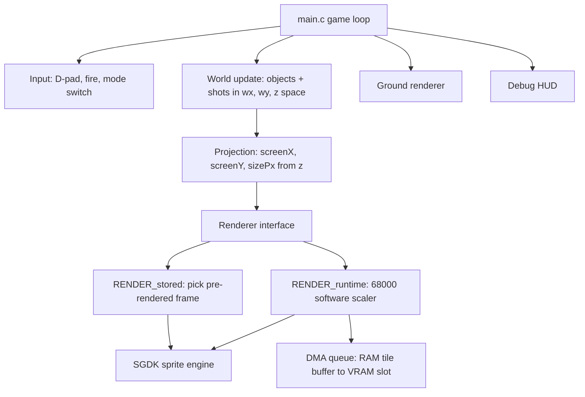

# Technical Plan (as built)

## Goal

Compare two techniques for large objects flying toward the player on stock
Mega Drive hardware (7.67 MHz 68000, VDP with no hardware sprite scaling):

1. **Stored frames** — many pre-rendered scale steps in ROM, selected by depth.
2. **Runtime scaling** — software nearest-neighbour scaling on the 68000.

Both share one gameplay shell and are toggled at runtime (C). START pauses.
The game loop targets 30 Hz on NTSC by waiting two VBlanks per update.

## Architecture

### Pseudo-3D projection (`src/engine/world.h`)

Objects live at `(wx, wy, z)` with `z` from 4096 (vanishing point) to 256
(player plane). All projection is integer maths:

- `screenX = 160 + wx * 256 / z`
- `screenYBottom = 96 + (110 - wy) * 256 / z`
- `sizePx = 64 * 256 / z` (a 64 px object at the player plane)

### Ground illusion (`src/engine/ground.c`)

The floor combines the techniques of the two reference Mega Drive
pseudo-3D games, at the machine's highest PAL resolution (320x240, V30):

- **Space Harrier II style plane**: a perspective checkerboard is
  pre-rendered into the full 64x32-tile (512x256) BG_B plane. SH2 skews its
  floor with a per-scanline H-scroll perspective table and moves the horizon
  by vertically scrolling a taller-than-screen tilemap — we do both:
  - **Lateral sway** uses per-scanline horizontal scroll. For a flat floor,
    shifting world X by W requires a screen shift of `W/z(y)`, and `1/z` is
    linear in screen Y — so the scroll table is a simple linear ramp. The
    plane is 192 px wider than the screen and the sway gain is capped so the
    window never wraps around the plane edge.
  - **Altitude** scrolls the plane vertically: the horizon sinks as the
    player climbs (16 px of travel). The on-screen horizon is exported as
    `GROUND_horizon` and consumed by the sprite projection so objects stay
    planted on the floor.
- **Burning Force style forward motion**: pure palette animation, no tile
  updates. The checker is pre-rendered with 8 colour indices — each depth
  cell is split into 4 quarter-depth phase bands, with the lateral cell
  parity folded in as a phase offset of 4. Each frame a fixed-point speed
  accumulator rotates the 8 palette entries; the entry currently crossing a
  band boundary is colour-blended over 4 sub-steps, so the board rushes
  toward the camera as a smooth sweep rather than discrete flips. Cost: 8
  CRAM writes per frame. (SH2 itself rewrote ~11 KB of tile data per frame
  for the same visual effect — unnecessary for a flat two-tone checker.)
- The lateral cell width is quantised to a multiple of 4 px per 8-line tile
  band, so each band's pattern repeats on the tile grid and rescomp dedupes
  the whole 512x256 plane down to ~41 tiles.

### Stored-frame renderer (`src/prototypes/stored_frames/`)

- `tools/gen_scale_frames.py` renders 50 sizes (8..64 px, ~1 px steps) of the
  64x64 master enemy onto 64x64 canvases, bottom-centre anchored, in one
  sprite sheet. rescomp trims empty 8x8 tiles, so small frames are cheap.
- At runtime: map `sizePx` to a frame index; `SPR_setFrame()` makes the
  sprite engine stream that frame's tiles to VRAM (only on changes).
- Cost: a table lookup per object per frame. Effectively free.

### Runtime-scaling renderer (`src/prototypes/runtime_scaling/`)

- Source art is stored as packed 4bpp linear (2 px/byte) in ROM
  (`enemy_src.bin`, 2048 bytes for 64x64).
- The scaler resamples to any size 8..64 px, writing **directly in VDP tile
  layout** (column-major 8x8 tiles) into a 2 KB RAM buffer — no separate
  conversion pass. Column source offsets are precomputed per rescale, so the
  inner loop is shifts/masks only.
- Each object owns a fixed 64-tile VRAM slot displayed by a 2x2 grid of
  32x32 hardware sprites (only the top-left quad is shown at sizes <= 32 px).
  The slot region sits at the top of user VRAM, below the sprite engine area.
- The buffer is uploaded with the SGDK DMA queue during VBlank (512 bytes for
  sizes <= 32 px, 2 KB otherwise).
- **Budget: at most one object rescale per frame**, chosen by largest visual
  error (biased to near/large objects). Objects keep their cached size
  otherwise — "semi-real-time" scaling.

### Audio

XGM2 driver; `WAV ... XGM2` resource. An original "Get ready!" placeholder is
synthesised by `tools/gen_voice.sh` (macOS `say` + ffmpeg) and played at boot
and on mode switch via `XGM2_playPCM()`.

## Identified 68000 assembly optimisation areas

The C scaler was profiled by the HUD CPU meter; if runtime scaling were
pursued, these inner loops are the targets, in order of value:

1. **Pixel-pair fetch/merge loop** — in asm, keep source row pointer, both
   nibble tables and the dest pointer in registers; unroll per tile line
   (4 bytes); use `move.b (a0,d0.w),d1` addressing instead of indexed C
   array reads. Expected 2-3x over GCC output.
2. **Fixed source-column stepping** — replace the per-column table lookup
   with an error-accumulator (Bresenham-style) carried in registers,
   removing both tables and their cache pressure entirely.
3. **memset of the slot buffer** — replace with `movem.l` block clears of
   only the tiles actually displayed.
4. **Dedicated per-size unrolled scalers** — generate (offline) one unrolled
   routine per even size 8..64; biggest win, large code cost (~30 KB), which
   a 16 Mbit cart can afford.

Even with all of these, scaling a 64x64 object means touching 4096 destination
pixels + 2 KB DMA; ~2 such objects per frame is the realistic ceiling. See
[comparison-notes.md](comparison-notes.md).

## Next steps toward a fuller game

1. Multiple enemy types: add master sprites + scale strips (the budget in
   [asset-budget.md](asset-budget.md) allows ~40 animated types).
2. Enemy animation: per-scale-step animation frames (wing flaps, rotation)
   in the stored pipeline — this is where stored frames pull far ahead.
3. Wave/attack patterns, curving flight paths (sine tables, splines).
4. Ground obstacles (trees/pillars) that the player must dodge; death/respawn.
5. Boss objects at 96-128 px using multi-sprite stored frames.
6. Proper Space Harrier camera: player X also steers the world (currently
   only sway). Altitude already moves the horizon (done).
7. ~~Checkerboard forward motion upgrade~~ — done: 4-phase palette cycling
   with blended band edges (Burning Force technique).
8. Music: an XGM2 BGM track (FM) alongside PCM voice; more voice clips
   ("Welcome to the fantasy zone", wave announcements) using the documented
   sample pipeline.
9. Score, lives, title screen, attract mode.
10. Real-hardware verification pass (EverDrive) — especially DMA queue load
    and sprite-per-scanline limits in heavy waves.
